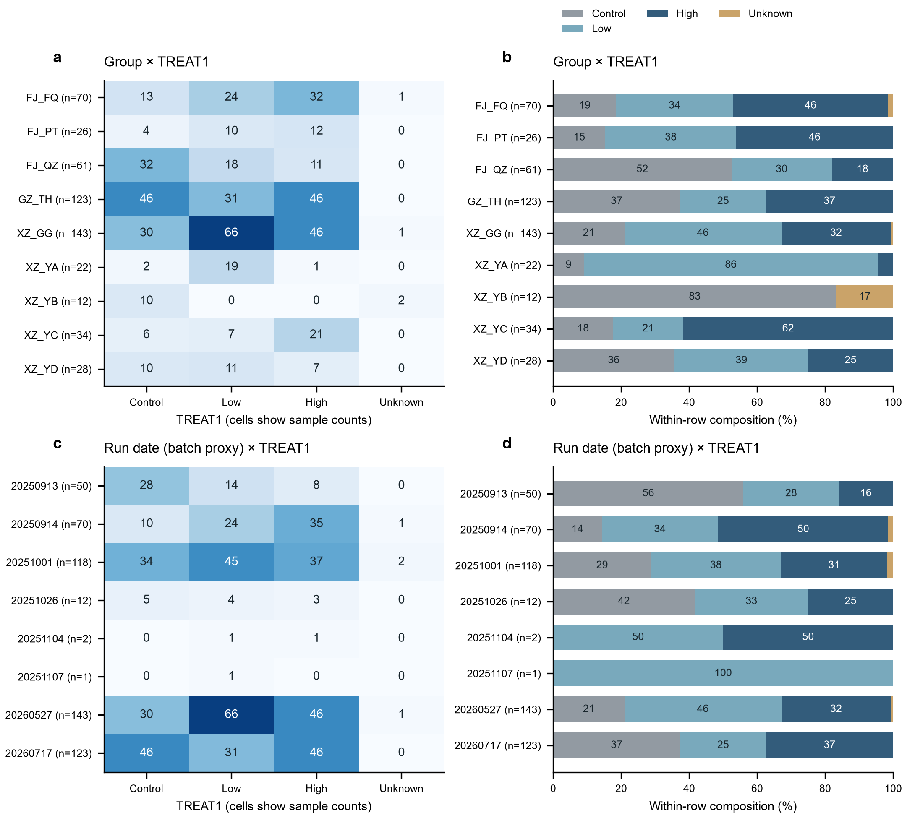
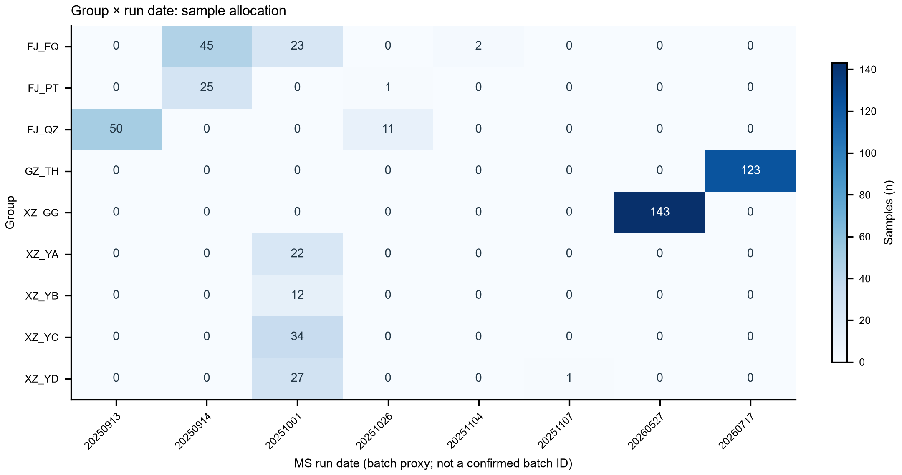
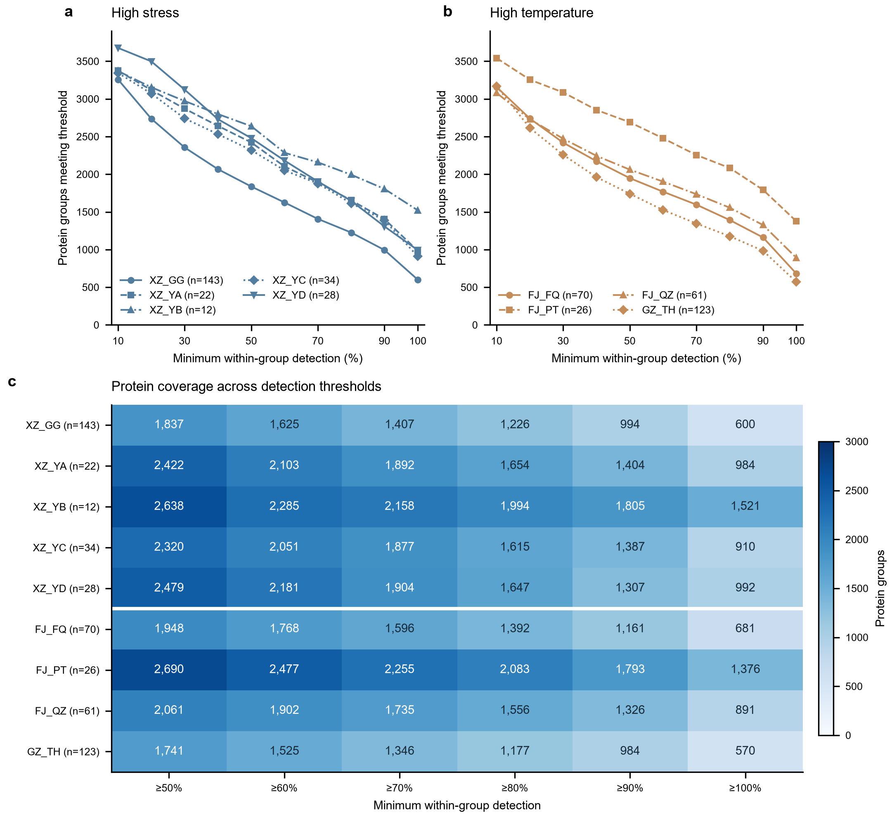
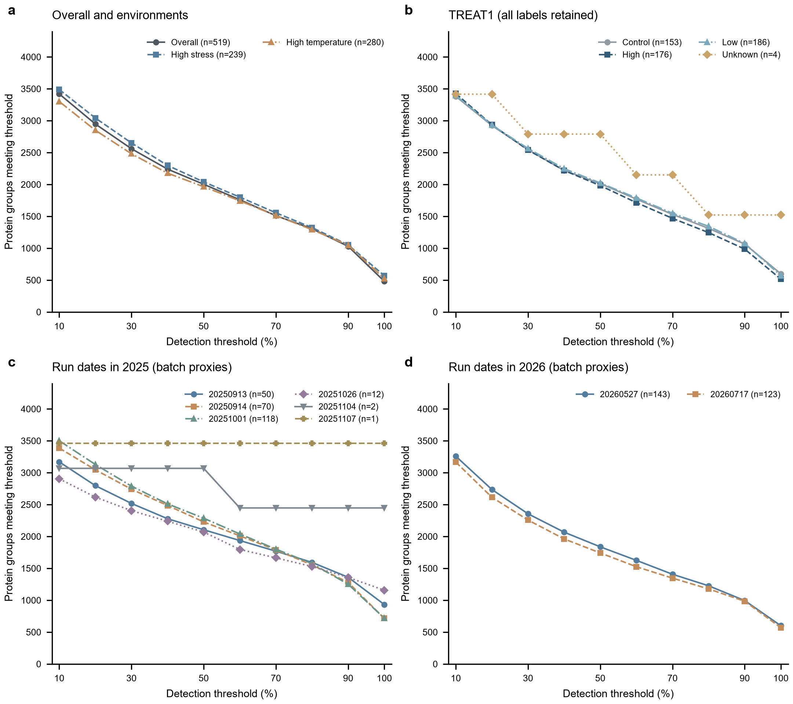
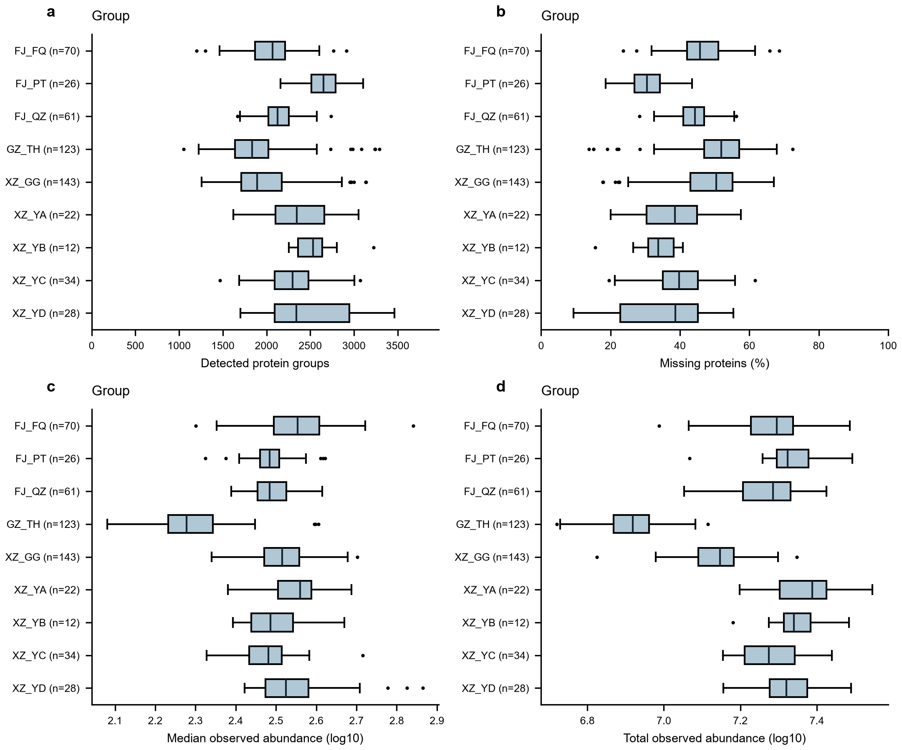
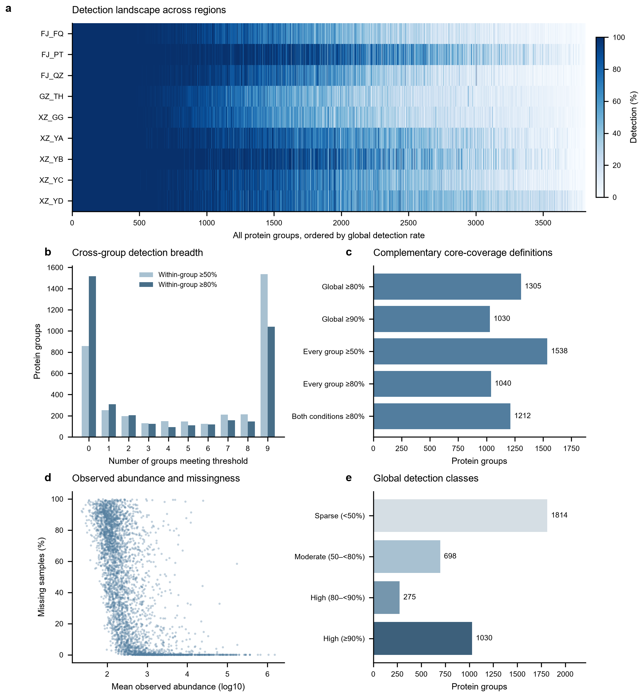

# 正式QC前数据描述：四层完整报告

## 分析边界与数据口径
纳入519个矩阵样本列、3817个蛋白组。源文件SHA256与已核验版本相同，列头及各样本检出数再次核对。原始缺失率44.99%；无零值、负值或非数值；不删除、填补、归一化或校正数据。以下“蛋白”均按PG.ProteinGroups行计数。
定量矩阵来自此前processed工作簿；这里的“原始”指本轮未进一步变换的输入值，不声称是仪器原始信号或未经上游处理的数据。

## 第一层：样本构成
总体519例；high_temperature 280，high_stress 239；9个地区。TREAT1为control 153、low 186、high 176、unknown 4、missing 0。零样本类别在构成表中保留为0；覆盖率及箱线图仅对有样本的类别计算，不构造空组统计。
有8个进样日期，metadata没有独立MS_batch字段，因此全部按MS_batch_proxy命名。
已提供group×condition、group×TREAT1、日期×TREAT1、group×日期以及group×日期×TREAT1的计数表，并提供TREAT1行内比例。

关键结构：
- 地区嵌套于环境，不能独立估计地区与环境效应。
- XZ_YB：control 10、unknown 2，没有low/high；XZ_YA：control 2、low 19、high 1。地区内暴露构成不平衡。
- XZ_GG全部143例对应20260527；GZ_TH全部123例对应20260717，这两个地区与各自日期完全对应。
- 20251104仅2例，20251107仅1例，描述保留，但覆盖曲线高度离散，不能用来判断技术稳定性优劣。

## 第二层：蛋白覆盖度与检出率梯度
对overall、condition、group、TREAT1及日期均完成≥1%、≥10%、≥20%、≥30%、≥40%、≥50%、≥60%、≥70%、≥80%、≥90%、100%覆盖统计，另列“至少1例检出”。
**≥1%不等于至少1例**：总体519例中≥1%要求至少6例；每组用ceil(t×n/100)判定。整数比较避免浮点边界误差。
纵轴是“达到阈值的蛋白组数”；只是累计描述，无实际过滤。各阈值集合嵌套，不能相加。下表为正文重点50%–90%。

| level | category | samples | 50 | 60 | 70 | 80 | 90 |
| --- | --- | --- | --- | --- | --- | --- | --- |
| condition | 湿热 | 280 | 1965 | 1743 | 1512 | 1291 | 1048 |
| condition | 高海拔 | 239 | 2040 | 1801 | 1555 | 1323 | 1052 |
| group | FJ_FQ | 70 | 1948 | 1768 | 1596 | 1392 | 1161 |
| group | FJ_PT | 26 | 2690 | 2477 | 2255 | 2083 | 1793 |
| group | FJ_QZ | 61 | 2061 | 1902 | 1735 | 1556 | 1326 |
| group | GZ_TH | 123 | 1741 | 1525 | 1346 | 1177 | 984 |
| group | XZ_GG | 143 | 1837 | 1625 | 1407 | 1226 | 994 |
| group | XZ_YA | 22 | 2422 | 2103 | 1892 | 1654 | 1404 |
| group | XZ_YB | 12 | 2638 | 2285 | 2158 | 1994 | 1805 |
| group | XZ_YC | 34 | 2320 | 2051 | 1877 | 1615 | 1387 |
| group | XZ_YD | 28 | 2479 | 2181 | 1904 | 1647 | 1307 |
| overall | Overall | 519 | 2003 | 1760 | 1510 | 1305 | 1030 |

同一阈值下，小组n不同、暴露构成不同，曲线不能直接排名为生物学或技术质量高低。n=1时所有已检出蛋白在所有阈值均达标，平直曲线不是稳定性证据。

## 第三层：样本检测深度与原始信号
每个样本输出：detected proteins、missing proteins、missing %、观测正值中位数、观测正值总和、均值及Q1/Q3。
分别按condition、group、TREAT1、日期绘制检测数、缺失率、中位信号、总信号箱线图（Figure7–10）；信号仅在绘图时取log10。未把缺失填成0；观测总和仅加总有效值，不等同全蛋白组总量。
箱体Q1–Q3，线为中位数，须为1.5×IQR内最远值，离群观测保留。n<5额外显示每个样本。每个箱体单位为样本列，独立受试者身份尚未核实，不进行检验。
缺失蛋白数=3817−检出数，缺失率与检出数提供同一信息的不同尺度；不将其视为独立证据。

## 第四层：蛋白检出一致性landscape
为每个蛋白提供全局、两个环境、9个地区、所有TREAT1标签及日期的检出率；输出在0–9个地区达标的分布和逐蛋白名单。
全局互斥分类采用<50%、50%–<80%、80%–<90%、≥90%；此外独立报告累计≥80%与≥90%“core”定义。core仅表示本队列中观测到的高检出覆盖，不等同普适的核心血浆蛋白组。

| 说明 | protein_groups |
| --- | --- |
| 全局检出率≥80% | 1305 |
| 全局检出率≥90% | 1030 |
| 每个地区均≥50% | 1538 |
| 每个地区均≥80% | 1040 |
| 两个环境均≥80% | 1212 |

| groups_meeting_threshold | protein_groups_ge50pct | protein_groups_ge80pct | protein_groups_ge90pct |
| --- | --- | --- | --- |
| 0 | 857 | 1516 | 1763 |
| 1 | 252 | 310 | 294 |
| 2 | 197 | 204 | 214 |
| 3 | 129 | 123 | 143 |
| 4 | 148 | 94 | 115 |
| 5 | 147 | 109 | 97 |
| 6 | 123 | 117 | 91 |
| 7 | 212 | 158 | 129 |
| 8 | 214 | 146 | 123 |
| 9 | 1538 | 1040 | 848 |

Figure11a展示全部蛋白在各地区的检出率（按全局检出率排序）；b展示每个蛋白在多少地区达到50%/80%；c是不同核心覆盖口径，集合可能重叠，不能相加；d为正值观测均值取log10与缺失率，不对缺失值补0；e为全局互斥覆盖分类。a/b/c/e为精确描述，无误差条或显著性检验。均值只由已检出值计算，缺失模式不能单独证明缺失机制。

## 文件与复现
- coverage_all_levels_long/wide.csv：五个层次完整梯度、实际需要检出的样本数（长表）、至少1例检出。
- sample_depth_and_signal.csv、sample_depth_signal_group_summaries.csv：样本明细和分层汇总。
- protein_detection_landscape.csv：完整蛋白检出率、分类与跨组广度。
- cross_group_detection_breadth.csv、core_coverage_counts.csv、proteins_*.csv：跨地区分布和各口径蛋白名单。
- Figure3–11均有PDF/SVG/PNG；原Figure1–2保留。样本结构详细交叉表见“QC前描述_样本构成与分析路线.md”。
- 运行顺序：describe_proteomics.py → detection_gradient.py → design_composition.py → complete_four_layers.py。

本轮不开展binary PCA、Jaccard聚类、异常样本剔除、插补或批次校正；样本检测相似性可以进入下一步正式QC。
